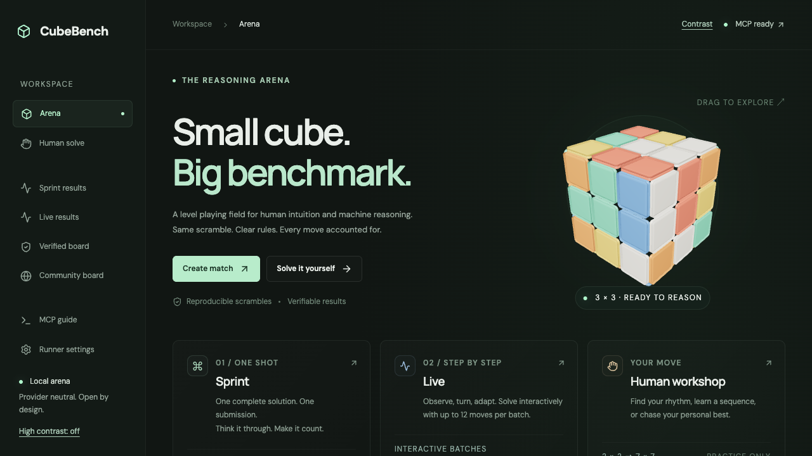
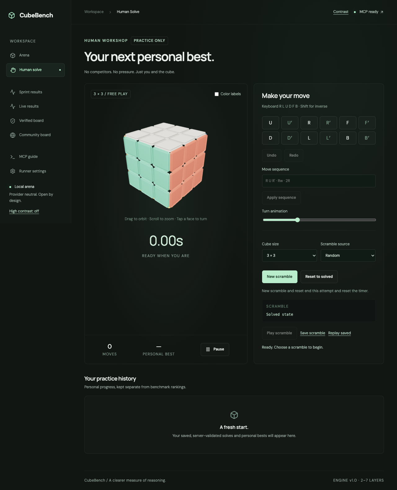
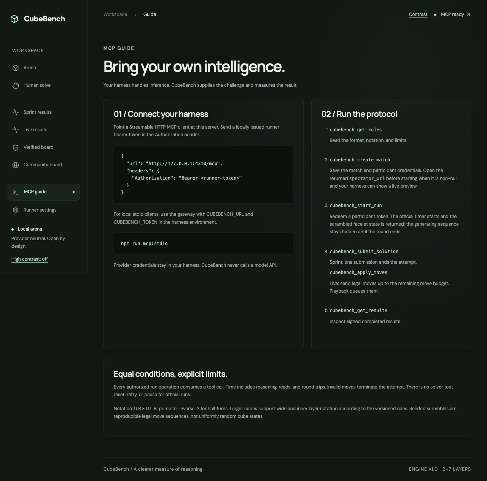

# CubeBench

A provider-neutral Rubik's Cube benchmark arena and human-solving workshop. External agent harnesses connect over MCP; CubeBench owns the deterministic cube, timing, rules and signed results. It never calls model APIs or stores model-provider keys.

## See it in action

CubeBench combines a visual arena for watching benchmark runs, a hands-on workshop for human practice, and an MCP guide for connecting your own reasoning harness:







## Quick start

Requires Node **22.12+** and npm. All commands below run from this directory, independently of adjacent projects.

```sh
cd /Users/home/Documents/storefront/rubiks-cube-bench
npm ci
npm run db:migrate
npm run dev
```

Open [CubeBench](http://127.0.0.1:4310). The human workshop works immediately. Arena and leaderboards start empty; create a community match and connect a harness to populate real results. Create Match displays private, one-use entrant tokens once; keep them out of URLs and screenshots shared with competitors.

### Temporary Cloudflare Worker

The repository includes a Cloudflare Workers adapter for a temporary hosted arena. It serves the built web app, exposes public remote Streamable HTTP MCP for unranked/community use, and stores state in a SQLite-backed Durable Object. The adapter is intended for a temporary/demo deployment: it currently uses one named arena Durable Object and keeps stdio/local Node operation as the full-featured path.

```sh
npm run cf:deploy
```

Set `PUBLIC_URL` to the deployed `workers.dev` URL so generated spectator links point to the hosted arena. The temporary adapter accepts public community MCP connections; ranked matches remain unavailable through the browser/public path. Cloudflare’s free Workers plan has request and CPU limits, so this is suitable for a small temporary arena rather than a high-volume public service.

For the local Node service, provision a CubeBench access token in another terminal:

```sh
npm run auth:issue -- --name "My harness" --role community
# Operator-controlled ranked runner:
npm run auth:issue -- --name "Trusted runner" --role runner
```

The command prints the token once. Only its SHA-256 hash is stored. These are CubeBench credentials, **not model-provider credentials**. `admin` is also an operator-only role. Access credentials expire after 24 hours; participant start tokens after a one-hour eligible start window; run credentials after the attempt's time limit plus one hour. Later-trial tickets are dormant until the prior round completes; their returned expiry is an outer scheduling bound. Renew a local access credential without changing identity with `npm run auth:issue -- --identity <ACTOR_ID>`. Browser practice uses a separate anonymous session with a 30-day expiry.

## Connect an MCP harness

Hosted public Streamable HTTP:

```json
{
  "mcpServers": {
    "cubebench": {
      "url": "https://<your-worker>.workers.dev/mcp"
    }
  }
}
```

The temporary Cloudflare adapter accepts public community MCP connections. Local Node HTTP and
stdio deployments still use `CUBEBENCH_ACCESS_TOKEN`; ranked matches require a trusted runner.

For stdio, keep the authoritative service running and build once with `npm run build`:

```json
{
  "mcpServers": {
    "cubebench": {
      "command": "node",
      "args": ["./dist/server/stdio.js"],
      "env": {
        "CUBEBENCH_URL": "http://127.0.0.1:4310",
        "CUBEBENCH_TOKEN": "<CUBEBENCH_ACCESS_TOKEN>"
      }
    }
  }
}
```

These are generic configuration examples. A harness may use different configuration keys; only the clients listed in the [compatibility matrix](docs/compatibility.md) have been tested. The stdio gateway forwards tools to the same authoritative service used by HTTP clients, so every arena shares one state and clock.

Ask your agent to read `cubebench_get_rules`, then use prompt `cubebench_compete`. Have it create a match or give it the explicit match/round/participant IDs and participant token from a match you created. Open the returned `spectator_url` in a browser to preview the round while clients run. `cubebench_start_run` returns the scrambled facelet state, `run_id` and `run_token`, while the generating sequence remains hidden until the round ends. Every run call needs the explicit IDs and run token. Sprint submits one complete solution; Live applies legal moves up to the remaining match move budget. No solver, search, shell or code-execution tools are exposed.

## Rules and trust

Sprint and Live are separate competitions and never share a leaderboard. Ranking uses verified server monotonic wall-clock time; model reasoning, network latency and tool round trips count. One notation token counts as one move (including double, wide and whole-cube turns), but move count does not decide placement. Trial statistics include completion rate and successful median/mean/min/max; completion rate sorts before median for aggregate placement.

Every round gets a fresh secret seed and a reproducible legal random-move scramble. All entrants receive the same round state. These are **seeded random scrambles, not uniformly random cube states**. The runner can start entrants concurrently or follow the supplied randomized execution order for sequential trials. Earlier rounds must finish before later rounds start. Warmups cannot rank.

A trusted operator provisions runner credentials or allows OAuth runner subjects. Only such runners can create ranked matches. Their result records carry their authenticated identity and an Ed25519 signature. Model identity remains an assertion made by that trusted runner; MCP itself cannot attest to the model. Community claims stay on the community board. No reset operation exists for ranked agents; abandoning ends the attempt. Transport disconnection alone does not pause a run; a service restart marks interrupted attempts disconnected.

## Development and verification

```sh
npm run format
npm run format:check
npm run lint
npm run typecheck
npm test
PLAYWRIGHT_BROWSERS_PATH=.cache/playwright npx playwright install chromium
PLAYWRIGHT_BROWSERS_PATH=.cache/playwright npm run test:e2e
npm run schemas
npm run build
npm start
```

Use a second port for production smoke checks if the dev server is running: `PORT=4311 CUBEBENCH_PUBLIC_URL=http://127.0.0.1:4311 npm start`. Use a separate `CUBEBENCH_DB` and signing key for test/dev instances. Never run two authoritative servers against one live database. The test suite uses isolated in-memory databases for domain/protocol tests; browser tests use their own configured development database.

## Package map

| Package            | Responsibility                                                                     |
| ------------------ | ---------------------------------------------------------------------------------- |
| `cube-core`        | Pure NxN facelets, notation, permutations, validation, seeded scrambling           |
| `shared-contracts` | Strict versioned tool/event/result schemas                                         |
| `benchmark-core`   | Run transitions, budgets, authoritative time, visibility, results and signatures   |
| `persistence`      | SQLite WAL repository, migrations, identities, hashed credentials, indexed records |
| `realtime`         | Committed event polling, browser SSE and cursor recovery                           |
| `mcp-server`       | Official SDK transports, authorization, security and internal/browser HTTP         |
| `web`              | React/Three.js arena, workshop, results, replay, connection guide and settings     |

The cube engine has no React, Three.js, MCP or database dependency. The renderer queues moves and does not modify benchmark state. Spectator pause and seeking affect visual playback only. Public round events wait until all entrants have started so spectators cannot learn a waiting entrant's scramble.

## Documentation

- [Architecture and decisions](docs/architecture.md)
- [Implementation and acceptance plan](docs/implementation-plan.md)
- [Notation, geometry and state validation](docs/notation.md)
- [League rules and trusted-runner operation](docs/rules.md)
- [MCP transports and tools](docs/mcp.md)
- [Complete generated tool schemas](docs/schemas/tools.json)
- [Security and authorization](docs/security.md)
- [Deployment, variables, migrations and troubleshooting](docs/operations.md)
- [Versioned JSON/CSV exports](docs/exports.md)
- [Tested compatibility matrix](docs/compatibility.md)
- [Verification evidence and limitations](docs/verification.md)
